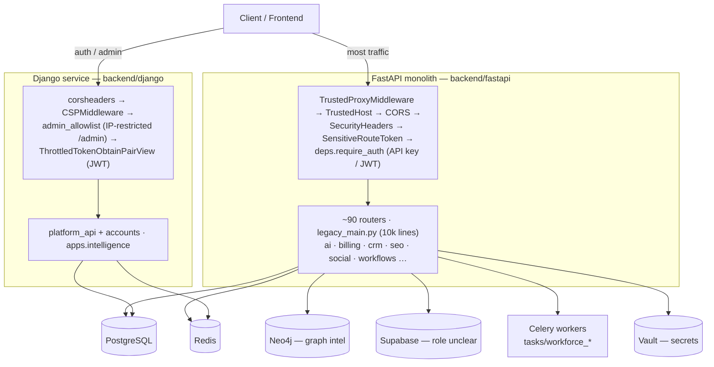
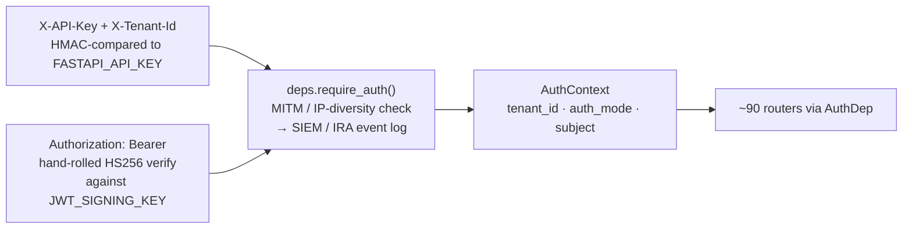

# Nuxtron Backend — Low-Level System Design

_Traced directly from `backend/fastapi/` and `backend/django/`. Reviewed 2026-08-04._

## 1. Overview

The backend is not one service — it's a large **FastAPI monolith** carrying nearly all product functionality, plus a much smaller **Django service** handling admin, token issuance, and health/compliance concerns. Nothing in the repo currently binds the two behind a shared gateway (no `docker-compose.yml`, no `Procfile` found — each has its own standalone `Dockerfile`).

| Component | Role |
|---|---|
| `backend/fastapi/` | Product monolith. ~90 routers, 60+ SEO service modules, multi-provider LLM layer, Celery workers, Stripe billing, SAML SSO. |
| `backend/django/` | Companion service: JWT token issuance (throttled), admin panel with IP allowlist, health checks, a narrower `intelligence` API. |
| Datastores | PostgreSQL (both services), Redis (cache/queue/session), Neo4j (graph intel, FastAPI only), Supabase (role unclear, see §5), Vault (secrets). |

## 2. System Topology

Both services front their own middleware chain and reach shared Postgres/Redis independently; nothing in the repo binds them behind a common gateway.

## 3. FastAPI Monolith

Entry point is thin by design: `app/main.py` imports the real application object from `app/legacy_main.py` — a single **~10,015-line module** that both defines and wires almost everything, including all `app.include_router()` calls.

### Middleware chain (execution order)

FastAPI middleware executes in reverse of registration order. Effective request-time order:

| Order | Middleware | Purpose |
|---|---|---|
| 1 | `TrustedProxyMiddleware` | Strips spoofable `X-Client-Cert-Verified` / `X-Forwarded-Proto`; enforces mTLS when `REQUIRE_MTLS` set. Added last → runs first. |
| 2 | `TrustedHostMiddleware` | Rejects requests with an unrecognized `Host` header. |
| 3 | `CORSMiddleware` | Origins from `_cors_origins()`; credentials disabled automatically if origin resolves to wildcard. |
| 4 | `SecurityHeadersMiddleware` | Standard hardening headers (from `production_middleware.py`). |
| 5 | `SensitiveRouteTokenMiddleware` | Token-only enforcement gate on a defined set of sensitive path prefixes. |
| 6 | `RequestTracingMiddleware` | Structured request logging / correlation IDs. |

### Route surface

~90 modules under `app/routers/`, each usually built by a factory function (`create_ai_router`, `create_stripe_billing_router`, …) that closes over a shared context object and an injected `enforce_rate_limit` callable — the DI pattern used throughout instead of plain global routers.

- **Growth & content** — `seo_platform`, `rank_tracker`, `content_approval`, `contentshake_ai`, `social_media_router`, `influencer`, `viralpost`
- **Revenue & ops** — `billing`, `stripe_billing`, `crm`, `crm_abm`, `revenue_attribution`, `super_admin_finance`, `tenants`
- **Intelligence & agents** — `agent_analytics`, `autonomous_workforce`, `neo4j_graph_intelligence`, `competitive`, `trend_intelligence`, `answer_engine`

> **⚠ Duplicate mounts.** `intel_router` is mounted at both `/api/v1/intelligence` and `/api/intel`; `social_media_router` is mounted at root and again under `/api/v1`. Versioning is applied per-router, not globally — `/api/v1/…` paths coexist with unversioned ones across the same codebase.

## 4. Auth Flow

FastAPI accepts two independent credential types on the same dependency; Django issues JWTs through a separate, throttled endpoint. `app/deps.py` is the single point of truth for FastAPI auth.

Dual credential modes converge on one `AuthContext`; tenant scoping downstream depends on routers consistently filtering by `tenant_id` (worth spot-checking, see §8).

Django runs a **parallel, unrelated auth path**: `rest_framework_simplejwt` with a custom `ThrottledTokenObtainPairView` at `/api/auth/token/`, plus `SessionAuthentication` for the admin (BasicAuth explicitly disabled). The two token schemes are not interchangeable — a Django-issued token is not validated by FastAPI's verifier or vice versa.

## 5. Data Layer

**FastAPI · SQLAlchemy 2.0** — updated 2026-08-06 (Phase 3 of the production-readiness plan; see `.claude/plans` history)
- `app/database.py` — engine, sessionmaker, `StaticPool` fallback (SQLite dev/test only)
- `app/models.py` — CRM/billing/workflow models (16), plus the new canonical `Tenant` model
- `app/models_lindy_email.py`, `app/models_lindy_meeting.py` — 15 models, now consolidated onto `BaseTenantModel` (previously hand-rolled their own `id`/`tenant_id`/timestamp columns)
- `app/stores/notifications.py` — `NotificationRow`; previously used a *second, disconnected* `declarative_base()` instead of the shared one, so its table was never actually created by `init_db()`/`create_all()` — fixed
- `alembic/`, `alembic.ini` — **now wired up for real.** `alembic/env.py` imports every live model module and resolves the DB URL the same way `app/database.py` does. Initial migration: `alembic/versions/fe7ee0840540_initial_schema.py`, verified via `alembic check` (zero drift against current models) and a full up/down cycle against SQLite. **Autogenerated against SQLite, not a live Postgres instance** (none was available) — the migration uses portable SQLAlchemy types throughout (`sa.String`, `sa.JSON().with_variant(postgresql.JSONB, ...)`, etc.) so it should be structurally correct for Postgres, but run `alembic upgrade head` against a staging Postgres instance and diff the resulting schema against production before trusting it as the baseline there — see the migration file's own docstring.
- `app/schema.sql`, `app/migrations/*.py` (ad hoc, pre-existing) — **left as-is, not yet folded into Alembic.** These cover a separate domain (SEO/graph-intelligence tables: `sites`, `pages`, `entities`, etc.) that never overlapped with the ORM models Alembic now tracks. Still a real gap — see §8.

**Tenant referential integrity** — every tenant-scoped table (31 models across the three files above) now has a real foreign key from `tenant_id` to a new canonical `Tenant` model (`models.py`), which maps onto the pre-existing `tenant_profiles` table `routers/tenants.py` has managed via raw SQL since before any ORM model or tracked schema existed for it — there was previously no `CREATE TABLE` for `tenant_profiles` anywhere in the repo at all. Because tenant_id has always just been "whatever string a valid JWT/API key carries" with no signup step, a hard FK would otherwise block ordinary usage; `app/database.py`'s new `before_flush` session event auto-provisions a minimal `Tenant` row the first time a given tenant_id is written via any ORM session, in the same transaction, so the constraint is never violated by normal traffic. Verified against the full ~300-file test suite with SQLite FK enforcement genuinely on (see below) — zero regressions.

> **Fixed: SQLite FK enforcement was silently a no-op.** `database.py`'s connect-time hook checked `dbapi_conn.__class__.__name__ == 'pysqlite3.dbapi2.Connection'`, but the stdlib `sqlite3` driver SQLAlchemy actually uses reports its class as plain `Connection` in module `sqlite3` — the check never matched. Every FK constraint in the test suite has been accepted but never enforced. Fixed to check the module name instead; foreign keys are now genuinely checked in the SQLite-backed test suite too.

> **Dead code found, not removed:** `SocialMediaContent` (`app/social_media/publisher.py`), `SocialAnalytics`/`AudienceMetrics` (`app/social_media/analytics.py`) look like SQLAlchemy models (they declare `__tablename__` and `Column(...)` class attributes, and were the source of the "3 of 35 models have an FK" note in an earlier version of this doc) but **do not inherit from any declarative `Base`** — they are inert plain classes, never registered with any ORM metadata, and have zero references anywhere else in the codebase. They do not create tables, cannot be queried, and `create_all()`/Alembic never see them. Left in place pending an explicit decision to delete rather than removed silently as part of a security/data-integrity pass.

**Django · ORM**
- `apps/accounts` — models.py + migrations/0001_initial
- `apps/intelligence` — models.py + migrations/0001_initial
- `platform_api` — main models + admin.py
- SSL enforced in prod via `_build_databases()`

Supabase (`app/core/supabase_client.py`) is present alongside direct Postgres access; the repo doesn't make explicit whether it's the primary datastore or an auxiliary one (auth/storage) — flagged in §8 as worth resolving before extending the data model.

## 5a. Row-Level Security — investigation spike (not implemented)

Per the production-readiness plan, this was scoped as a spike, not a rollout — no RLS policies exist yet. Findings, for whoever picks this up next:

- **No live Postgres was available to prototype against in this environment.** Everything below is analysis from reading the code and Postgres RLS semantics, not a tested result — treat it as a starting point for design, not a verified plan.
- **Connection pooling is the main hazard.** `database.py` uses a pooled `QueuePool` in production (`DB_POOL_SIZE`/`DB_MAX_OVERFLOW`), so connections are reused across requests/tenants. RLS policies read a session GUC (e.g. `current_setting('app.tenant_id')`); it must be set with `SET LOCAL` inside each transaction (transaction-scoped, cleared automatically) — never plain `SET` (session-scoped, would leak a stale tenant_id to the next pooled request that reuses the connection if a code path forgets to reset it).
- **Table ownership.** Postgres RLS does not apply to a table's owner by default. If the app's DB role is also the migration/owner role (the common default), policies would silently not apply unless every tenant table has `FORCE ROW LEVEL SECURITY` set, or the app connects as a separate, non-owner role from the one Alembic migrates with.
- **Where to set the GUC.** `AuthContext.tenant_id` is resolved in `deps.require_auth`, but DB sessions are opened separately, per-router, via `get_db_session()` — there is currently no threading of tenant identity into session acquisition. RLS needs `get_db_session()` (or a new tenant-aware variant) to accept the resolved `tenant_id` and issue `SET LOCAL app.tenant_id = :tid` as the first statement in the transaction.
- **`tenant_profiles` itself needs a different policy** (or none) than tenant-owned data tables — it's the tenant registry, not tenant-owned content; the just-in-time auto-provisioning insert (§5) also needs to keep working under whatever policy is chosen.
- **Admin/cross-tenant routes need an explicit bypass design.** `super_admin_finance.py`, the `/ops/siem/*` routes, etc. sometimes need cross-tenant visibility — RLS needs either a `BYPASSRLS` role used narrowly (and audited) or per-route policy carve-outs, not a blanket bypass.
- **Testing gap:** SQLite (what the whole test suite runs against) has no RLS equivalent at all. Validating RLS policies requires either a real Postgres test container in CI (tying back to Phase 4's docker-compose/CI work) or a separate, smaller Postgres-only test suite for policy behavior specifically.

Recommendation: treat as a follow-up project with its own design doc once Postgres is available to test against, not a quick addition — the connection-pool/GUC-scoping detail alone is the kind of thing that's easy to get subtly wrong and have it fail silently (policy just doesn't apply) rather than loudly.

## 6. Django Service

Deliberately narrow: two apps (`accounts`, `intelligence`) plus the `platform_api` app that owns routing, health checks, and admin.

| Path | Handler | Notes |
|---|---|---|
| `/admin/` | Django admin | gated by `admin_allowlist` middleware (IP-restricted) |
| `/api/` | `platform_api.urls` | core service routes |
| `/api/intelligence/` | `apps.intelligence.urls` | narrower intel surface than FastAPI's |
| `/api/auth/token/…` | simplejwt views | obtain (throttled) · refresh · verify · blacklist |
| `/api/schema/…` | drf-spectacular | OpenAPI + Swagger/Redoc UI |

Security posture: CSP via `config/csp.py`, `corsheaders`, admin IP allowlist, Redis-backed rate limiting/session store — a tighter, more conventional Django security setup than the FastAPI side's bespoke middleware stack.

## 7. Async & External Integrations

**Background work**
- Celery — broker/backend via `REDIS_URL`
- `app/tasks/workforce_tasks.py`
- `app/worker.py` — worker entrypoint
- `app/redis_cache.py` — async cache decorator layer
- `app/event_bus.py` — internal pub/sub eventing

**External services**
- LLM providers — OpenAI, Anthropic, Vertex, Cohere, Mistral, Together, Stability — tiered failover
- Social clients — Facebook, Instagram, LinkedIn, TikTok, Twitter
- Stripe — billing router
- SAML SSO — `python3-saml`, separate from the JWT path
- Vault — `hvac`-backed secret config

## 8. Risks & Open Questions

| Severity | Item | Why it matters |
|---|---|---|
| 🟡 Medium | `schema.sql` / ad hoc `app/migrations/*` not yet folded into Alembic | Alembic is now wired up and tracks the ORM models (§5), but the separate SEO/graph-intelligence schema (`sites`, `pages`, `entities`, …) is still managed outside it — two schema-management stories instead of one. Downgraded from 🔴 now that the ORM half has a real migration tool; this is the remaining half. |
| 🟡 Medium | Duplicate route mounts | `intel_router` and `social_media_router` each mounted twice under different prefixes — invites inconsistent versioning and doubled maintenance. |
| 🟡 Medium | Supabase's role is unstated | Coexists with direct Postgres access; unclear if it's primary storage, auth, or file storage only — matters for where new tables should live. |
| ⚪ Low | `legacy_main.py` at 10k lines | Nearly the whole app boots from one file; router-splitting is done, but startup/DI wiring is not. |
| ⚪ Low | RLS not implemented | Scoped as a spike (§5a) with concrete findings recorded — connection-pool GUC scoping is the main design risk, needs a real Postgres instance to validate before rollout. |

**Resolved in Phases 1–3** (kept here for history — see git log / `.claude/plans` for the full write-ups): JWT self-issue impersonation path, client-controlled RBAC in IRA actions, in-memory rate limiting and MITM detection (now Redis-backed), FastAPI/Django token schemes (Django now validates FastAPI-issued tokens via a shared secret), no Alembic wiring for the ORM schema, no FK constraints on `tenant_id`, dead `SocialMediaContent`/`SocialAnalytics`/`AudienceMetrics` "models" and a disconnected `NotificationRow` base (documented above, not yet deleted), and a SQLite FK-enforcement check that never matched.

---
_Sources: `backend/fastapi/app` (legacy_main.py, main.py, deps.py, database.py, models.py, config.py, routers/), `backend/django` (config/, platform_api/, apps/)._
